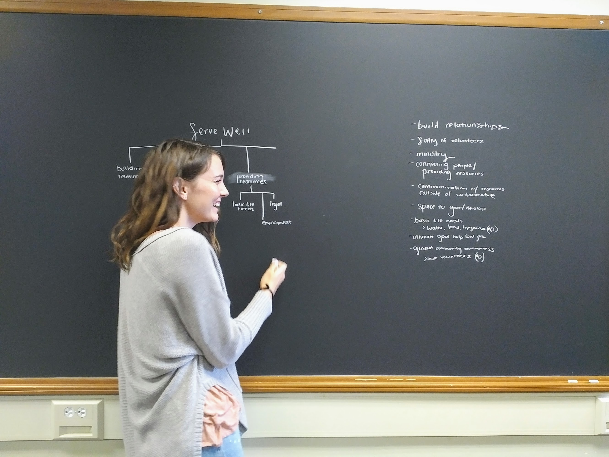

People make thousands of decisions every single day.  Some are small, repetitive, and low stakes: which brand of toothpaste to buy, what to have for lunch, what to wear to work.  Other decisions have higher stakes: where to go to school, what career to pursue, who to marry.  Organizational decisions may have larger environmental, economic, and societal impacts.

The Westmont Decision Lab, or DLab for short, is a collection of activities that help people and organizations make better decisions.  These activities usually fall into one of the following three categories:

* Decision support projects: We work directly with community partners to help them frame, model, and analyze high-stakes decisions
* Decision training workshops: We train leadership teams to make high quality, value-focused decisions
* Writing projects: We reflect upon and write about decision making

### Our philosophy of decision making

We think of high-quality decisions as those that exhibit 6 qualities:

*	a helpful frame
*	an understanding of the organization's values and objectives as they relate to the decision at hand
*	distinct and viable alternatives 
*	relevant and reliable information 
*	logical reasoning 
*	a commitment to following-through

A decision can only be as good as the weakest of this qualities are called the Decision Quality Chain.  Nonetheless, this notion of decision quality guides everything we do.

We didn't invent the Decision Quality Chain or the tools and techniques we use to live it out. Actually, we are students and practitioners of Decision Analysis, a branch of Management Science and Operations Research that draws upon a variety of disciplines including economics, statistics, mathematics, and psychology.

### What is decision support?

We support our partner organizations' decision making with a range of analytical tools and techniques. Each partner and project is different, so we tailor work to suit the  decision context. Partners either face complex value trade-offs, significant uncertainty, or constraints, want help understanding their environment.

High level, strategic decisions are complicated by complex value trade-offs, significant uncertainty, and/or constraints that make the path forward challenging. Decision support in these contexts involves decision modeling.   We begin by eliciting and structuring relevant  values and objectives, and identifying and modeling key alternatives and uncertainties.  With these elements we build decision mathematical models of the decision to promote appropriate framing, clarify values, generate viable alternatives, incorporate relevant information, and support rational thinking.

Our partners sometimes face decisions where the environment is unclear.  They may be acutely aware of a problem, but they may not know the cause of it.  When the decision maker has data about the environment, we use statistics and data visualization to help them understand the contours of the landscape.  When the decision maker doesn't have data, we can help them identify relevant measures, and design and implement data collection, storage, reporting, and analysis tools.  This type of support helps decision makers clarify values, recognize the relevance of their information, and support rational thinking.

At the DLab, everything we do promotes high quality decision making.

### Examples of our work

#### Strategic planning at the zoo

Senior management was considering purchasing a second site to overcome the physical constraints on their existing site. The Westmont Decision Lab worked with senior management across the organization to build a multi-attribute decision model.  The model considered a wide variety of strategic priorities for the Zoo, potential configurations of the new and existing site, and key risks.

#### A data collection strategy to fight homelessness

The Westmont Decision lab created a mobile data collection weekly survey for a collaborative of organizations providing services to individuals experiencing homelessness.  The tool gathers data related to meals, medical services, case management services, hygiene services, clothing, animal welfare, and other services to communicate with government and the community.  

The DLab then built a [dashboard](neighbor_nav_center_dash.html) to summarize and report these service metrics in real time.

#### A data collection strategy for a non-profit empowering women in Africa

The DLab worked with the executive director of a non-profit that supports women in Uganda through farming and child support programs.  The partner wanted to overhaul their data collection process to increase efficiency, improve reliability, and reduce cost. The DLab help choose and implement a new platform and trained leaders in its use.

#### Visualizing admission data to explore leading indicators of student success

Westmont Decision Lab students worked with college leaders to characterize students at risk of not graduating.  DLab recommendations supported revisions to the advising system.

#### Supporting a large capital investment decision for a historic landmark

Westmont Decision Lab students worked with Executive Director of a historic landmark considering renovating and repurposing one of its campus buildings.  Students worked with stakeholders across the organization, designed value and decision models, and recommended a new strategy for the facility.

### Who is the Westmont Decision Lab?

The DLab is directed by Enrico Manlapig, who staffs and oversees projects.  Students participate in DLab projects through different classes and as independent study projects.  

Two classes, in particular, support DLab projects.  

* **Applied Management Science** is a class in decision analysis and operations research. Students are learning to frame, structure, and analyze complex decision problems at a strategic level. Projects exhibiting conflicting values, uncertainty, and/or complexity are ordinarily supported by this class. 

* **Business Research & Forecasting** is an introduction to data analytics and econometric modeling. Students are practicing data manipulation, statistical analyses, and visualization.  Projects that involve wading into data or data collection are usually assigned to Research and Forecasting.  

